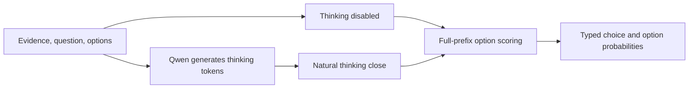

# Jev + Reasoning

**Objective: test whether reasoning can help with some of the weaknesses described for Jev, while preserving a typed decision interface.**

We build an open-source **Jev-like prototype with frozen Qwen3-0.6B**, following the direct option-scoring design in [SemIf](https://github.com/TheoLeeCJ/SemIf). We then enable Qwen's existing thinking mode before reading the final option probabilities.

This reproduces an interface pattern, not TypeSafe's proprietary Jev architecture, training, calibration, or performance. All measurements below are our Qwen experiments; we did not call the Jev API. The motivating failure categories come from [TypeSafe's Jev 1.13 limitations](https://docs.typesafe.ai/model-jaggedness/jev-1.13): indirection, negation, counting, dates, and distracting context.

**Current finding:** thinking repairs some elementary inference errors, but costs more time and does not reliably repair counting or deeper reasoning.

## The motivating example

> Rae is round. Anyone round is not blue. Is Rae blue?

The logical steps are short:

1. `round(Rae)` is supplied as a fact.
2. The rule is `round(x) → not blue(x)`.
3. Therefore `not blue(Rae)`; the answer is **No**.

This illustrates the inference the model must carry out. It does not mean that generating a verbal scratchpad is necessary for every model or prompt.

We tested this exact short question with choices **A: Yes, B: No, C: Unknown**. Direct mode was already correct. Thinking retained the correct answer and increased its option probability, at higher latency:

| Exact short Rae prompt | Decision | P(No) | Thinking tokens | Latency |
|---|---|---:|---:|---:|
| Thinking off | No ✓ | 57.73% | 0 | 0.069 s |
| Thinking on, seed 17 | No ✓ | 99.9953% | 193 | 5.720 s |
| Thinking on, seed 18 | No ✓ | 99.9948% | 208 | 6.084 s |
| Thinking on, seed 19 | No ✓ | 99.9981% | 163 | 4.770 s |

Higher option confidence on one correct example is not evidence of general calibration. [Exact prompts, traces, and timings](results/rae-short-v1/predictions.jsonl).

### A measured repair of the same logical pattern

Our earlier R1 case used the facts **“Rae Aspen is awake”** and **“Rae Aspen is round,”** the rule **round → not blue**, and classified **“Rae Aspen is blue”** as True/False/Unknown.

| Original R1 Rae case | Decision | P(correct: False) | Thinking tokens | Diagnostic latency |
|---|---|---:|---:|---:|
| Thinking off | True ✗ | 0.5543% | 0 | 0.475 s |
| Thinking on | False ✓ | 99.9902% | 277 | 8.542 s |

The saved trace applies the rule to roundness and selects the explicit negation. This is a selected demonstration of **wrong → correct**, not proof that all such problems require textual reasoning. The short and original prompts differ in wording, names, extra context, and option descriptions; they are not an isolated test of any one of those factors. [Original prompt](docs/rae-original-prompt.txt) · [Thinking trace](docs/rae-original-thinking.txt) · [All R1 records](results/r1-mode-capacity-v1/predictions.jsonl).

## How we build the open-source Jev-like baseline

We use the **interface idea from SemIf**, not an implementation of Jev's undisclosed internals:

1. Load [Qwen3-0.6B](https://huggingface.co/Qwen/Qwen3-0.6B) at a pinned revision; freeze its weights.
2. Supply the evidence, decision criterion, and an enumerated set of options.
3. Map each option to a single-token slot such as A, B, or C.
4. With thinking disabled, evaluate the prompt ending in `Answer:\n` and read the next-token logits at those slots.
5. Normalize only those logits and return the corresponding typed value plus its option distribution.

For option logits `z`, the distribution is `p(i) = exp(z_i) / sum_j exp(z_j)` over the declared choices. No final answer sentence or JSON is generated and parsed. We verify that each slot is one token and that appending it does not change the prompt's tokenization.

The result is type-constrained **when a readout succeeds**; it can still choose a wrong value. These conditional probabilities are not guaranteed calibrated. This package implements one decision at a time and does not reproduce SemIf's shared-state batching or Jev's parallel multi-question serving.

Reference: [SemIf at ca3ba65f](https://github.com/TheoLeeCJ/SemIf/tree/ca3ba65f142967030ecb453346e94d6f476a69df). Its MIT attribution is retained in [THIRD_PARTY_NOTICES.md](THIRD_PARTY_NOTICES.md). NanoJev was also inspected during planning, but its implementation is not used; see [provenance](docs/PROVENANCE.md).

## How we add reasoning



Both modes use the same frozen checkpoint and task instructions. Thinking mode changes the chat template, samples a textual scratchpad, and then scores the answer options conditioned on that scratchpad. We recompute the complete prefix for the final readout rather than relying on the earlier experimental cached readout path.

- Thinking: temperature 0.6, top-p 0.95, top-k 20, min-p 0; seeds 17/18/19 for individual examples.
- Maximum 2,048 generated tokens through `</think>`; it is a ceiling, not a fixed duration.
- A trace that never closes is a failure with no typed decision; we do not force a closing token.
- No fine-tuning, new head, latent recurrence, or learned compute controller is added.
- Traces are saved for research inspection; the outward decision remains bounded.

[Runnable implementation](scripts/run_showcase.py) · [Method and scope](docs/METHOD.md).

## A few examples, including failures

| Example | Correct answer | Direct answer | Thinking answers, seeds 17/18/19 | Interpretation |
|---|---|---|---|---|
| Exact short Rae question | No | No | No / No / No | Both modes succeed |
| Original R1 Rae case | False | True | False (one historical seed) | Elementary inference repair |
| R count in `rasperry` | 3 | 5 | 2 / 3 / 2 | Occasional repair; unreliable |
| R count in `strawberry` | 3 | 7 | 2 / 2 / 2 | No repair |

The counting traces often spell the letters correctly, then miscount their own list. On `strawberry`, thinking assigns **98.5–99.6%** option probability to the wrong answer 2. A plausible explanation and confident distribution do not guarantee correctness. [Per-run metrics and trace interpretation](docs/RESULTS.md).

### Beyond selected examples: 36 elementary cases

The earlier R1 diagnostic used the same 36 synthetic direct-fact/one-rule cases in both modes, balanced across three labels and query polarities. These are fresh names in known templates, with one reasoning seed per case.

| Qwen3-0.6B, answer-cued readout | Thinking off | Thinking on |
|---|---:|---:|
| Accuracy | 33.3% (12/36) | 97.2% (35/36) |
| Macro F1 | 0.167 | 0.972 |
| Negative log likelihood ↓ | 4.378 | 0.175 |
| Summed multiclass Brier ↓ | 1.304 | 0.054 |
| ECE, 10 bins ↓ | 0.658 | 0.042 |
| Median diagnostic latency | 0.476 s | 7.168 s |
| p95 diagnostic latency | 0.608 s | 11.649 s |
| Mean thinking tokens | 0 | 259.1 |
| Peak PyTorch allocation | 1.225 GB | 1.373 GB |

There were **23 paired repairs and no regressions**. Median diagnostic latency rose about **15×**. The full frozen R1 gate still failed: one semantic cell was 2/3, and native generated answers usually violated the letter-only format. The typed readout is a separate measurement. [Metrics](results/r1-mode-capacity-v1/small_cost_quality.json) · [Frozen protocol](archive/source/experiments/mode_capacity/r1_v1.json).

**Timing scopes differ:** R1 includes two typed readouts and a generated-answer control. The newer individual examples include one typed readout and no generated final answer. Both exclude loading and initial tokenization. Compare modes within each experiment; do not interpret cross-experiment latency ratios as like-for-like serving speedups. All runs used FP16, batch size one, on an RTX 2070 Max-Q.

Earlier ProofWriter depth-3/5 evaluation did **not** establish deeper reasoning recovery: direct accuracy was 50.4%, versus 38.3% for the validation-selected 32-token reasoning condition. Different budgets/readouts mean this is a separate experiment, retained to prevent overgeneralizing the positive elementary result. [Archived M1 report](archive/m1/report.md).

## Reproduce and inspect

Inspect the bundled evidence without a GPU or third-party Python packages:

```bash
python3 scripts/verify_evidence.py
python3 scripts/run_showcase.py --case rae-short --output results/local-rae --dry-run
```

Run inference on a CUDA machine:

```bash
python3 -m venv .venv
.venv/bin/python -m pip install torch==2.6.0 --index-url https://download.pytorch.org/whl/cu124
.venv/bin/python -m pip install -r requirements.txt
.venv/bin/python -m pip check

# First use downloads the pinned Qwen weights; omit --case to run all 3 cases.
.venv/bin/python scripts/run_showcase.py \
  --case rae-short --output results/local-rae
```

Output directories must be new. Each run saves exact prompts, token IDs, traces, probabilities, timings, source/model hashes, and PID-matched GPU evidence. Use `--local-files-only` when the pinned checkpoint is already cached. [Detailed reproduction](docs/REPRODUCE.md).

## What we can claim

**Textual reasoning can repair some elementary decisions behind a Jev-like interface in frozen Qwen3-0.6B.** That supports the possibility of a reasoning-assisted typed interface.

It does not establish that we fixed Jev itself, generalized to its other weaknesses, obtained calibrated probabilities, or preserved direct-mode efficiency. The exact short Rae case does not show an accuracy gain, counting remains unreliable, and deeper reasoning is unresolved. Selected examples are explicitly exploratory; three seeds on one question are not three independent questions.

## Layout

- `scripts/run_showcase.py`: standalone comparison runner.
- `experiments/showcase/cases.json`: exact example definitions and gold answers.
- `results/`: complete R1 and individual-example outputs, including failures.
- `docs/`: method, metrics, source attribution, and reproduction details.
- `archive/`: original research source and earlier negative M1 report; some historical scripts require data not bundled here.
- `provenance/`: imported evidence hashes and verification results.

The existing MIT project license is retained. Model weights and reference repositories are not bundled or modified.
